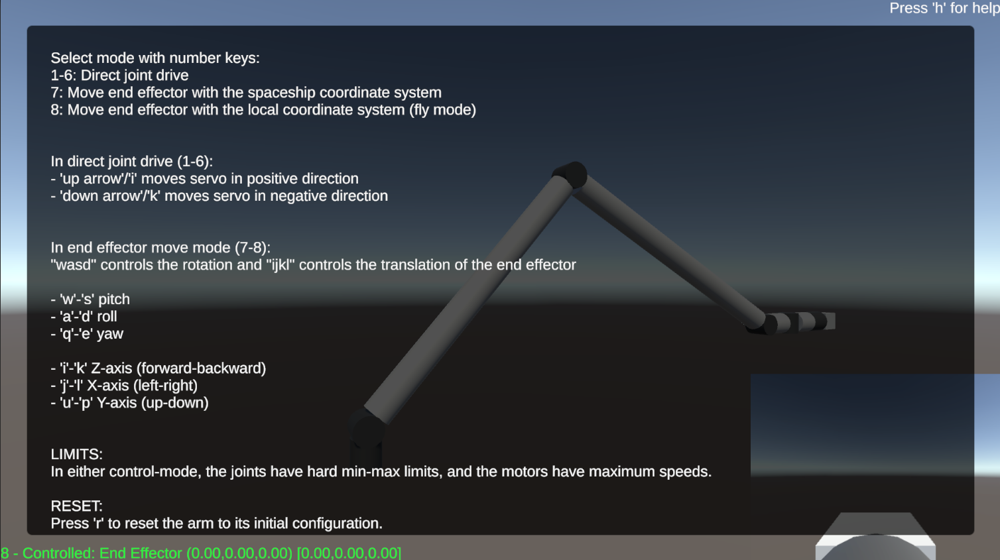

# ShuttleRMS
A little project for playing around with inverse kinematics for the [Space Shuttle Remote Manipulator System (Canadarm)](https://en.wikipedia.org/wiki/Canadarm).

### Useful public NASA technical reports
1. [An overview of the space remote manipulator system](https://ntrs.nasa.gov/citations/19850008655)
2. [Modelling the Shuttle Remote Manipulator System: Another flexible model](https://ntrs.nasa.gov/citations/19940020868)
